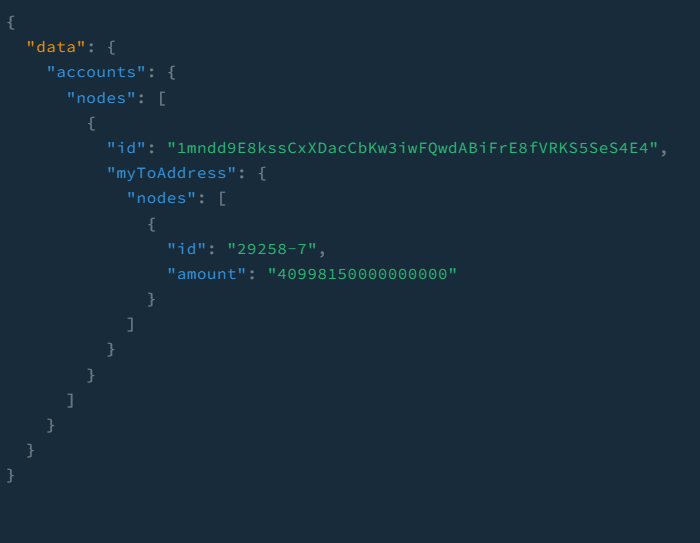

# What is SubQuery?

SubQuery powers the next generation of Polkadot dApps by allowing developers to extract, transform and query blockchain data in real time using GraphQL. In addition to this, SubQuery provides production quality hosting infrastructure to run these projects in.

# SubQuery Example - Account transfers Reverse Lookup

This subquery example adds a reverse lookup field on Account.myToAddress meaning that it is accessible from the Account entity but is just a reference or pointer back to Transfer.to.

## 1. Example query to run

```shell
query{
  accounts(first:5){
    nodes{
      id
      myToAddress{
        nodes{
          id
          amount
        }
      }
    }
  }
}
```
## 2. Result

# tutorials-account-transfer-reverse-lookups
